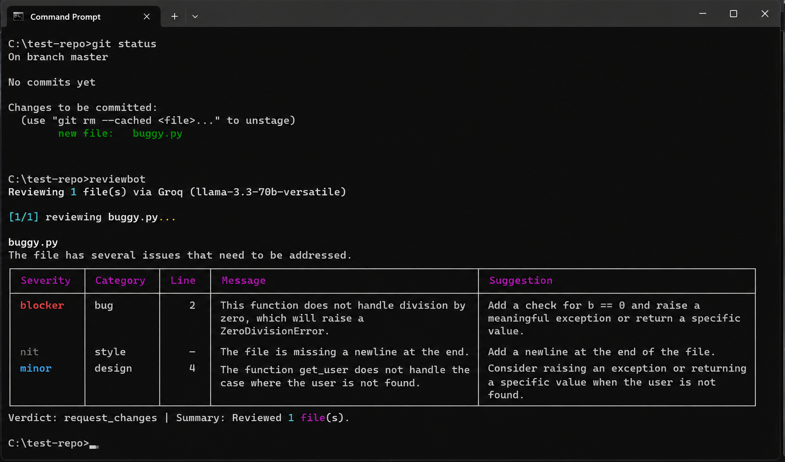

# ReviewBot (Under-Production)

AI-powered code reviewer that runs from your terminal. Point it at any git repo, and it reviews staged changes or recent commits using either Groq or Ollama, returning structured, severity-ranked comments with concrete fix suggestions.



## Features

- **One-command setup** - interactive wizard configures everything on first run
- **Zero-friction review** - just type `reviewbot` inside any git repo
- **Schema-validated output** - every LLM response is parsed into strict Pydantic v2 models with automatic repair on malformed JSON
- **Severity-ranked comments** - blocker, major, minor, nit - with categories (`bug`, `security`, `perf`, `style`, `design`, `docs`)
- **Git-native** - reviews staged changes, last commit, or a single file directly from unified diffs
- **Multiple review modes** - `errors`, `security`, `perf`, `style`, `explain`, and `detail`
- **Per-repo memory** - stores prior reviews in `.reviewbot/history` so follow-up reviews can go deeper
- **Rate-limit safe** - synchronous processing with 3s inter-call throttle, 10s backoff on 429, max 3 retries
- **Dual backend support** - Groq for fast cloud inference or Ollama for fully local/offline review

## Getting Started

### 1. Prerequisites

- **Python 3.11+** - check with `python --version`
- **pipx** - install with `python -m pip install --user pipx && python -m pipx ensurepath` (then reopen your terminal)
- **Git** - any recent version
- **Groq API key** (free) if you plan to use the cloud backend - get one at [console.groq.com/keys](https://console.groq.com/keys)
- **Ollama** if you plan to use the local backend - install from [ollama.com](https://ollama.com)

### 2. Install ReviewBot

```bash
pipx install git+https://github.com/Nilay-Mehta/reviewbot.git
```

Or from source:

```bash
git clone https://github.com/Nilay-Mehta/reviewbot.git
cd reviewbot
pipx install -e .
```

After installation, the `reviewbot` command is available globally from any terminal window.

### 3. First Run Setup

Open any terminal and type:

```bash
reviewbot
```

The setup wizard launches automatically and walks you through:

1. **Backend selection** - choose Groq (cloud, free tier) or Ollama (local)
2. **Credentials / host** - enter your Groq API key or confirm your Ollama host
3. **Model** - press Enter to use the default model or type a different one
4. **Connection test** - verifies the backend works before saving

Your settings are saved to `~/.reviewbot/config.toml`. You only do this once. To reconfigure later, run `reviewbot setup`.

### 4. Review Your First Diff

```bash
cd your-project
git add .
reviewbot
```

That's it. ReviewBot reads your staged changes, sends each file to the configured backend, and prints a severity-ranked review report in your terminal.

## Usage

Review staged changes (default):

```bash
reviewbot
```

Review the last commit:

```bash
reviewbot --last
```

Review a single file:

```bash
reviewbot --file path/to/file.py
```

Run a specific review mode:

```bash
reviewbot --mode security
reviewbot --mode explain
reviewbot --mode detail
```

Full command reference:

- See [COMMANDS.md](COMMANDS.md) for the complete command guide and examples.

Re-run setup anytime:

```bash
reviewbot setup
```

Uninstall ReviewBot:

```bash
pipx uninstall reviewbot
```

## Review Modes

- **errors** - default mode for bugs, logic issues, edge cases, and missing error handling
- **security** - only security findings such as injection risks, secrets, auth gaps, and unsafe subprocess/file handling
- **perf** - only performance concerns such as unnecessary round-trips, poor complexity, or wasteful allocations
- **style** - only readability and style issues
- **explain** - no critique; summarizes what each diff does in plain English
- **detail** - follow-up review mode that uses recent repo-local review history as context

## How It Works

```text
git diff --cached / git show / file diff
      |
      v
  diff_parser ---- split unified diff into per-file chunks
      |
      v
  history ------- load recent reviews for detail mode (optional)
      |
      v
  prompt_builder -- inject diff, schema, mode prompt, and prior context
      |
      v
  clients ------- choose GroqClient or OllamaClient
      |
      v
  llm backend ---- call the configured model in JSON mode
      |
      v
  output_parser --- validate against Pydantic schema, repair if needed
      |
      v
  history ------- save successful reviews to .reviewbot/history
      |
      v
  reporter ------ Rich report with colored severity + exit code
```

Each file is reviewed independently so line references stay grounded. In `detail` mode, ReviewBot loads recent high-severity findings from `.reviewbot/history` and injects that context so follow-up reviews can avoid repeating old feedback and go deeper on new issues.

## Pre-commit Hook

Auto-review on every commit:

```bash
cp hooks/pre-commit .git/hooks/pre-commit
chmod +x .git/hooks/pre-commit
```

Commits with blocker or major findings are blocked. Bypass with `git commit --no-verify`.

## Tech Stack

- **Python 3.11+**
- **Typer** - CLI framework
- **Rich** - terminal formatting
- **Pydantic v2** - schema validation
- **Groq SDK** - cloud LLM client
- **Ollama HTTP API** - local LLM backend
- **Llama 3.3 70B** / local code models - review engines

## License

MIT
